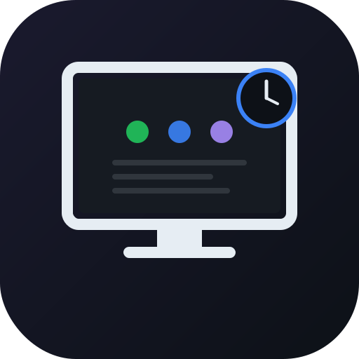
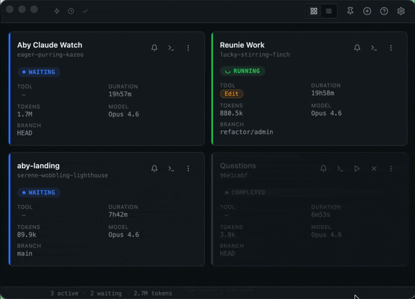
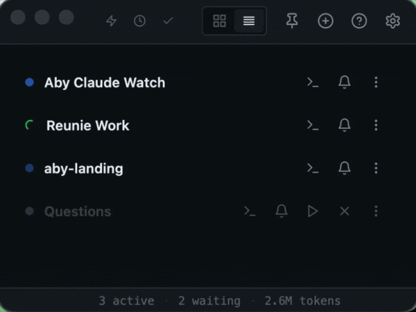
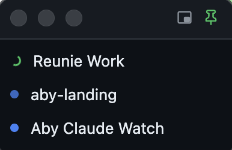

<div align="center">



# Aby Claude Watcher

**Real-time dashboard for your Claude Code sessions.**
See every session at a glance — thinking, running tools, or waiting for your input.

[](https://github.com/aby-agency/aby-claude-watcher/releases/latest)
[](LICENSE)
[](#install)
[](https://aby-agency.fr)

</div>

---

## Why

If you run more than one Claude Code session at a time, you know the pain: you start a long task in one terminal, switch to another, and twenty minutes later you realise Claude has been silently waiting for a permission prompt. Aby Claude Watcher keeps every session on screen, notifies you the moment one needs you, and jumps you back to the right terminal in one click.

Built at **Aby Agency** to solve our own daily workflow — shipped as MIT open source for anyone who ships with Claude.

<div align="center">
  
</div>

<div align="center"><em>Grid view with live sessions — states, tool pills, tokens, model, branch, all real-time.</em></div>

<details>
<summary><strong>Compact view</strong> — always-on-top list mode</summary>

<div align="center">
  
</div>

</details>

<details>
<summary><strong>Micro view</strong> — ambient status dots, pinned to a corner</summary>

<div align="center">
  
</div>

<div align="center"><em>The most minimal mode — just dot + name per session. Click a line to jump to its terminal.</em></div>

</details>

---

## Features

- **Auto-detects every Claude Code session** running on your Mac (`~/.claude/sessions/`)
- **Five states, color-coded** — *thinking*, *running*, *waiting*, *error*, *completed*
- **Two views** — grid and compact list, drag to reorder
- **Always-on-top** — pin the window over your IDE
- **Per-session notifications** — in-app toast + sound when a session needs attention
- **One-click focus terminal** — supports iTerm2, Terminal.app, Warp, VSCode, Cursor, Ghostty, kitty, WezTerm, Hyper
- **Resume session** from the dashboard
- **Remote Control indicator** — globe icon when a session exposes a remote URL
- **Tool pills** color-coded by category (Bash, Read, Edit, Agent, MCP…)
- **Cost estimation** and token counters per session
- **Git branch** displayed per session
- **Bilingual UI** — French and English, runtime switcher
- **Menu-bar icon** with tray popover summary
- **Dock badge** for waiting sessions
- **Auto-launch at login** (opt-in)
- **Manual update checker** via GitHub releases (no auto-download, no phone-home)

---

## Install

### macOS (Apple Silicon)

1. Download the latest `.dmg` from [**Releases**](https://github.com/aby-agency/aby-claude-watcher/releases/latest)
2. Open it and drag **Aby Claude Watcher** to `/Applications`
3. **Important — first launch:** the app is ad-hoc signed (not notarized by Apple). macOS Gatekeeper will block a double-click. Instead:
   - **Right-click** the app in `/Applications` → **Open**
   - A warning dialog appears → click **Open**
   - From then on, the app launches normally

> Intel (x64) build not yet available — open an issue if you need one.

### From source

```bash
git clone https://github.com/aby-agency/aby-claude-watcher.git
cd aby-claude-watcher
npm install
npm start        # production mode
npm run dev      # with devtools
```

Build the `.dmg` yourself:

```bash
npm run build
```

### Vue bureau (assets de jeu)

La vue « bureau » utilise les packs pixel-art de [LimeZu](https://limezu.itch.io/)
(Modern Interiors, Modern Office). Leur licence interdit la redistribution des
assets : ils ne sont **pas dans le repo**. Pour générer l'atlas en local :

    BAKE_ASSETS_SRC=/chemin/vers/les/packs npm run bake

Sans atlas, l'app fonctionne normalement — le bouton de vue bureau est
simplement masqué. Merci à LimeZu pour les assets. 🌱

---

## Usage

### The five states

| State | Color | Triggered when |
|---|---|---|
| **thinking** | purple | Claude is processing a user message |
| **running** | green | A tool is executing (Bash, Read, Agent…) |
| **waiting** | blue | Claude finished and is waiting for your input |
| **error** | red | An error appeared in the session |
| **completed** | grey | Session ended cleanly |

### Shell wrappers (optional, recommended)

Two helper binaries live in `bin/`. Add them to your `PATH` to make the "Focus terminal" button land in the **exact** terminal window that started the session:

```bash
# in your .zshrc / .bashrc
export PATH="$PATH:/path/to/aby-claude-watcher/bin"
```

Then:

```bash
cc       # start a new Claude Code session (wraps `claude`)
cwa      # resume the last session (wraps `claude --resume`)
```

The wrappers open a Unix socket at `/tmp/aby-claude-watcher.sock` and register the host terminal's identifier so the app can switch back to it precisely.

### Keyboard shortcuts

| Shortcut | Action |
|---|---|
| `1`–`9` | Focus session 1–9 |
| `V` | Toggle grid / compact view |
| `P` | Toggle always-on-top |
| `/` | Search sessions |
| `?` | Show keyboard shortcuts |
| `Esc` | Close modal / dropdown |

### Permissions

The **Focus terminal** feature uses AppleScript. On first use, macOS will ask for **Automation** permission for your terminal app — approve it once in *System Settings → Privacy & Security → Automation*.

---

## FAQ

<details>
<summary><strong>Why is the build unsigned / why does macOS warn me?</strong></summary>

Apple Developer ID signing + notarization costs $99/year. Until we commit the budget, we ship ad-hoc signed builds. The right-click → Open trick is the official macOS bypass for unsigned apps and only needs to be done once per install.
</details>

<details>
<summary><strong>Does it send any data over the network?</strong></summary>

No telemetry, no analytics, no phone-home. The **only** outbound call is when you explicitly click *Check for updates* in Settings — a single HTTPS request to `api.github.com/repos/aby-agency/aby-claude-watcher/releases/latest`. Everything else runs locally.
</details>

<details>
<summary><strong>Where is my config stored?</strong></summary>

`~/Library/Application Support/aby-claude-watcher/config.json`

Sessions, window position, custom names, notification preferences, language, and auto-launch setting all live there.
</details>

<details>
<summary><strong>How do I uninstall?</strong></summary>

1. Quit the app (menu bar icon → Quit)
2. Drag `Aby Claude Watcher.app` from `/Applications` to the Trash
3. Optionally remove `~/Library/Application Support/aby-claude-watcher/`
</details>

<details>
<summary><strong>Does it work with claude-code running inside Docker / WSL / a remote SSH?</strong></summary>

Only sessions whose JSONL files land in your local `~/.claude/sessions/` are detected. Remote / containerised sessions would need their files bind-mounted here.
</details>

<details>
<summary><strong>Can I contribute?</strong></summary>

Yes — issues and pull requests welcome. Read [CLAUDE.md](CLAUDE.md) for architectural decisions and the state-machine rationale before opening a PR.
</details>

---

## Architecture

```
main.js         Electron main — window, IPC, tray, notifications
watcher.js      Session discovery + JSONL parsing + state machine
socket.js       Unix socket (cc / cwa wrappers)
focus.js        Terminal focus via AppleScript
config.js       Persistent config (debounced writes, saveSync on shutdown)
i18n.js         Translations (FR / EN) — shared main ↔ renderer
preload.js      Context bridge
ui/             Renderer — vanilla HTML/CSS/JS, no framework
bin/            cc / cwa shell wrappers
```

No build step for the UI, no bundler, no framework. Opening `ui/index.html` in a browser gets you 90% of the look. The dependency tree ends at Electron itself.

---

## Credits

The design decisions (states, polling interval, notification cooldown, waiting delay) are documented in [`CLAUDE.md`](CLAUDE.md).

Built with [Electron](https://www.electronjs.org/), iconography inspired by [Lucide](https://lucide.dev/).

---

## License

[MIT](LICENSE) © [Aby Agency](https://aby-agency.fr)

<div align="center">

Made with care by **[Aby Agency](https://aby-agency.fr)** — web & AI studio, France.

</div>
